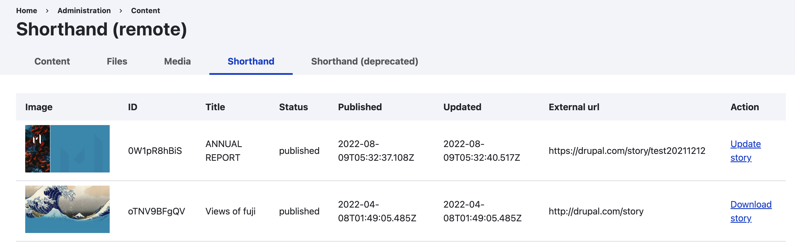
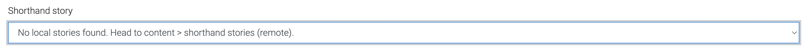
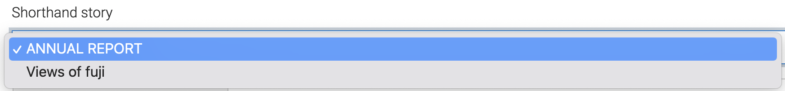

# Shorthand

This module provides integration with [Shorthand](https://shorthand.com/), an
application which describes itself as "beautifully simple storytelling". It
connects your Shorthand account with Drupal and allows you to publish your
stories on a Drupal website.

## Installation

- [Install Drupal module](https://www.drupal.org/docs/extending-drupal/installing-modules).

## Configuration (version 4)

- Login to [shorthand account](https://shorthand.com/signin)
  and [generate API key](https://support.shorthand.com/en/articles/62-programmatic-publishing-with-the-shorthand-api).
- Visit configuration page at `/admin/config/services/shorthand` to set API key
  and other settings.
- Download remote stories locally at `/admin/content/shorthand`.

- [Add `Shorthand select` field](https://www.drupal.org/docs/user_guide/en/structure-fields.html)
  (`Reference` field category) to desired entity (content type, taxonomy term or
  user). Note that `Shorthand Story ID` field (`General` field category) was 
  deprecated and will be removed in version 5.

## Usage

- When editing / managing entity with Shorthand field, select one of the
downloaded stories.

### No stories were downloaded

### Stories were downloaded

### Metatags

Make sure to enable modules `Metatag: Twitter Cards` and 
`Metatag: Open Graph` from [Metatag module](https://www.drupal.org/project/metatag) 
in order to leverage story metatags. If above modules are not enabled,
existing metatags won't be processed.

If metatags are overriden on the entity (node, user, taxonomy), 
the story metatag will be discarded.

If there are multiple stories, only first stiry metatags will be used.
